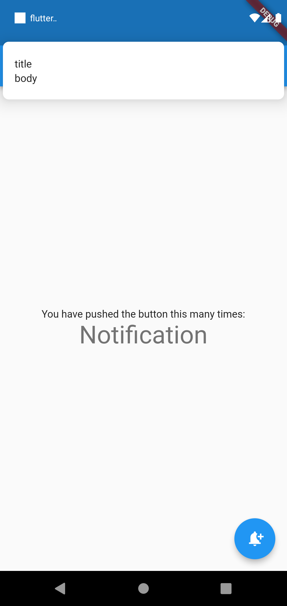

# flutter_local_notification

A new Flutter project for better understanding of local notification.

### Some References

* https://pub.dev/packages/flutter_local_notifications
* https://www.youtube.com/watch?v=awy03UeN_ZM
* https://www.dbestech.com/tutorials/flutter-local-notification-explained-for-ios-and-android

### Steps :1

* add flutter_local_notifications: plugin
* In your project folder go to your ios folder and find 'AppDelegate.Swift' and add a code before return statement of
  application

```swift
if #available(iOS 10.0, *) {
  UNUserNotificationCenter.current().delegate = self as? UNUserNotificationCenterDelegate
}
```

### Step :2 Initialize the plugin

* initialization settings for android
* initialization settings for ios
* combine both initialization settings
* pass both the combined initialization settings to initialize the plugin 'flutter_local_notifications'

### Step :3 To show Notification we need to create NotificationDetails

* notification details android
* notification details ios
* combined notification details
* call show and pass combined notification details
* you may show the notification on the spot or schedule it for latter

### Screenshot(s)

